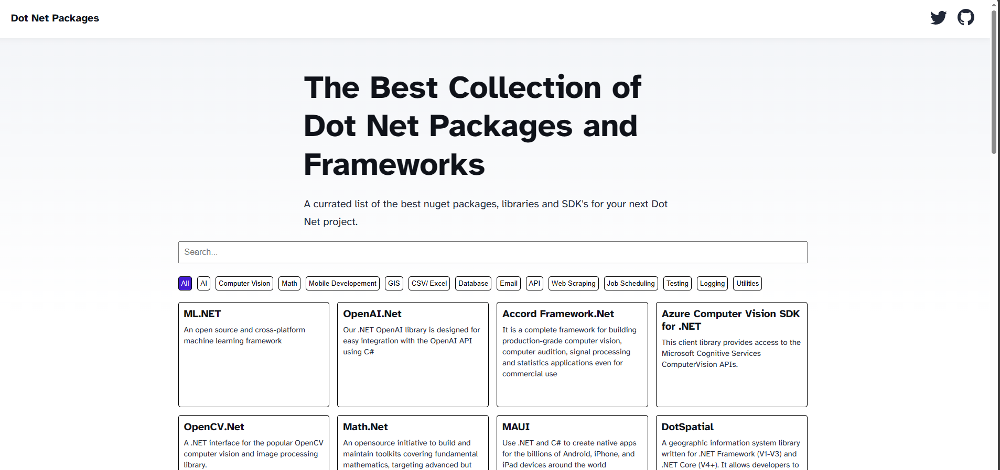
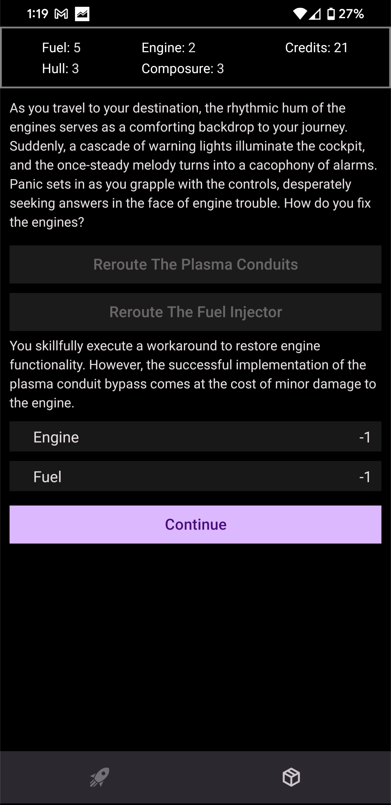
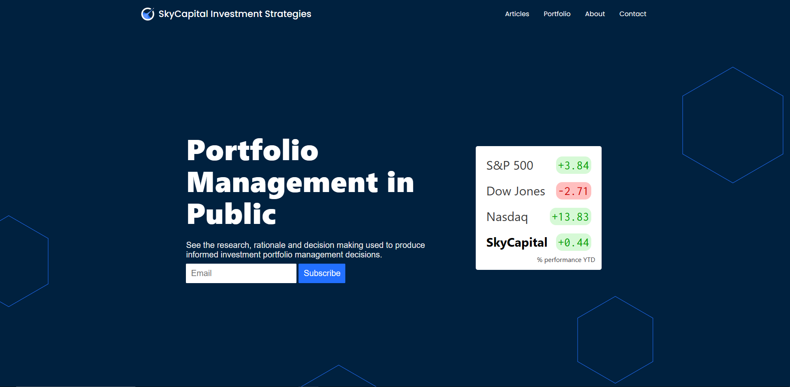
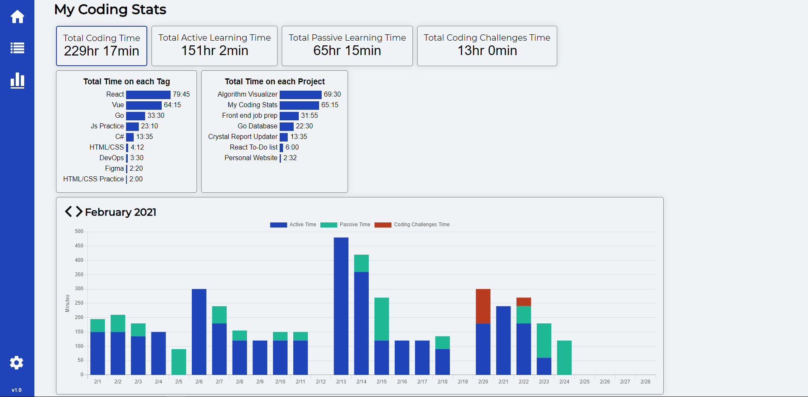
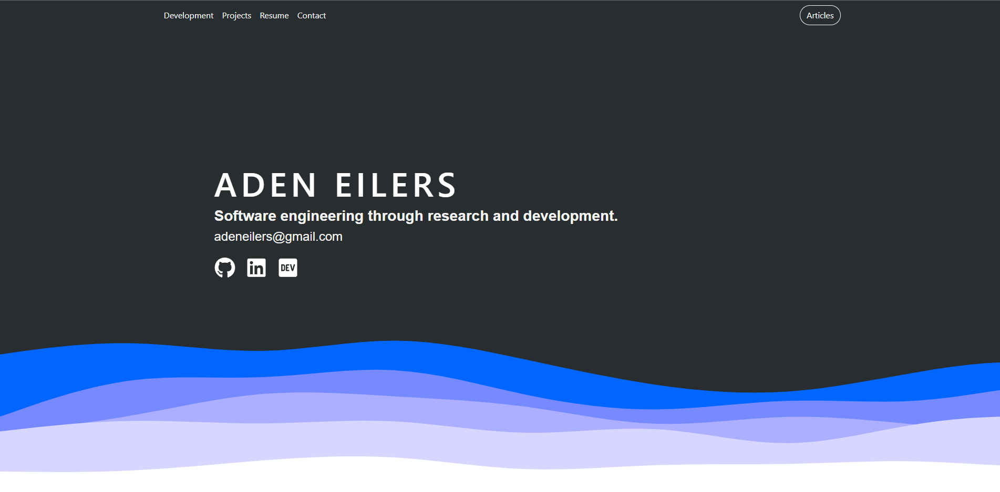
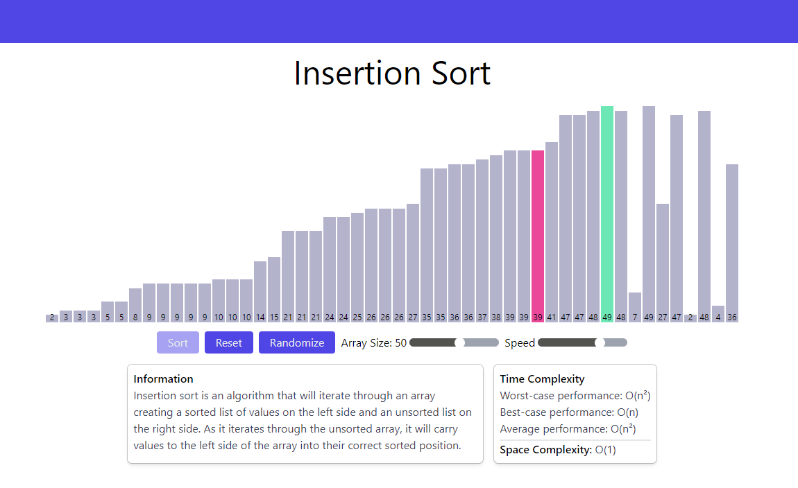
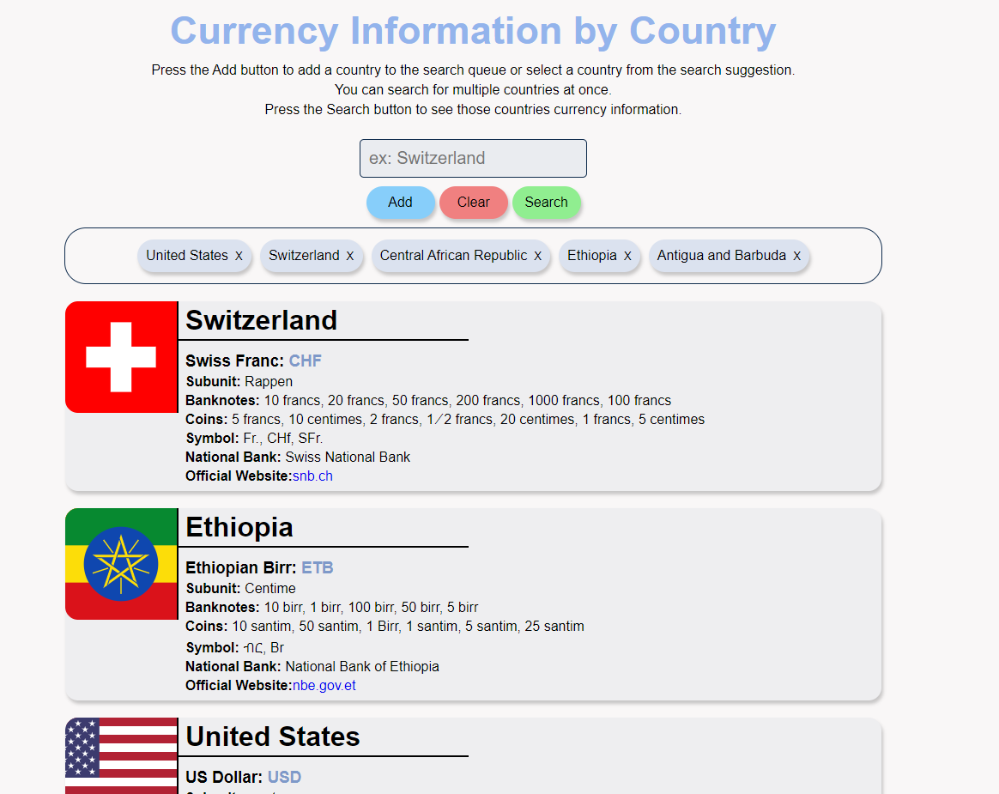
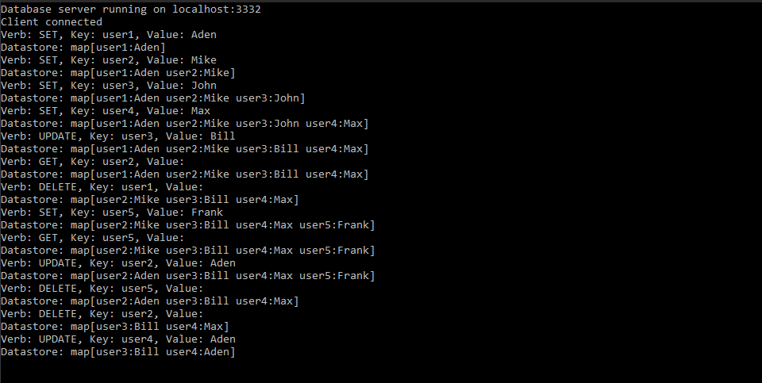
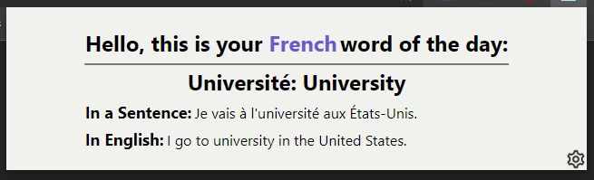

  <!-- DEVELOPMENT SECTION -->
  <section class="container pt-5" id="development">
    <h2 class="mb-3">Development</h2>
    

      

        <h4 class="card-title">Frontend</h4>
        

          

            
            
Html

          

          

            
            
CSS

          

          

            
            
Javascript

          

          

            
            
Typescript

          

          

            
            
React.js

          

          

            
            
Vue.js

          

          

            
            
Angular

          

          

            
            
Tailwind CSS

          

          

            
            
Bootstrap

          

        

      

    

    

      

        

          <h4 class="card-title">Backend</h4>
          

            

              
              
Node.js/ Express.js

            

            

              
              
Python

            

            

              
              
PostgreSQL

            

            

              
              
SQL Server

            

          

        

      

      

        

          <h4 class="card-title">Other</h4>
          

            

              
              
Git

            

            

              
              
Agile Scrum

            

          

        

      

    

  </section>

  <!-- PROJECTS SECTION -->
  

    <h2 class="mb-3">Projects</h2>
    

      <!-- Mobile Card Game -->
      

        

          
          

            <h4 class="card-title">In Progress Mobile Card Game</h4>
            

              react native
              javascript
              typescript
            

            
This is an ongoing project for an Android game similar to Harthstone.

          

        

      

      <!-- .NET Packages Directory -->
      

        

          
          

            <h4 class="card-title">.NET Packages Directory</h4>
            

              astro.js
              html
              css
              javascript
            

            
This is a site with a currated list of the best and most popular .NET packages. It is specifically created to make revenue from Google Ads.

            

              <button class="btn btnProjects">
                <a href="https://frameworkdotnet.com" target="_blank" rel="noreferrer">View Live</a>
              </button>
              <button class="btn btnProjects">
                <a href="https://github.com/fig781/dotnet-packages-directory" target="_blank" rel="noreferrer">Source Code</a>
              </button>
            

          

        

      

      <!-- Space Minor Game -->
      

        

          
          

            <h4 class="card-title">Unreleased Space Minor Mobile Game</h4>
            

              react native
              javascript
              typescript
            

            
This is an un-released android game. It is a text based rpg about a space minor.

            

              <button class="btn btnProjects">
                <a href="https://github.com/fig781/space-minor-app" target="_blank" rel="noreferrer">Source Code</a>
              </button>
            

          

        

      

      <!-- SkyCapital -->
      

        

          
          

            <h4 class="card-title">SkyCapital Investment Strategies</h4>
            

              next.js
              html
              css
              javascript
              typescript
            

            
This is a fullstack site where my friend and I publicly manage an investment portfolio.

            

              <button class="btn btnProjects">
                <a href="https://financial-blog-fig781.vercel.app/" target="_blank" rel="noreferrer">View Live</a>
              </button>
            

          

        

      

      <!-- Coding Stats -->
      

        

          
          

            <h4 class="card-title">myCodingStats</h4>
            

              vue.js
              html
              css
              javascript
              node.js
              express.js
              postgreSQL
              heroku
            

            
This is a fullstack site where people learning to program can track the time they spend each day learning to code.

            

              <button class="btn btnProjects">
                <a href="https://my-coding-stats-com-client.vercel.app/" target="_blank" rel="noreferrer">View Live</a>
              </button>
              <button class="btn btnProjects">
                <a href="https://github.com/fig781/myCodingStats.com-Client" target="_blank" rel="noreferrer">Client Source Code</a>
              </button>
            

          

        

      

      <!-- Personal Site -->
      

        

          
          

            <h4 class="card-title">My Personal Site</h4>
            

              next.js
              html
              css
              javascript
              typescript
              bootstrap
            

            
This is my personal site. It is fully responsive, and includes a contact form and article page.

            

              <button class="btn btnProjects">
                <a href="https://github.com/fig781/fig781.github.io" target="_blank" rel="noreferrer">Source Code</a>
              </button>
            

          

        

      

      <!-- Sorting Algorithm Visualizer -->
      

        

          
          

            <h4 class="card-title">Sorting Algorithm Visualizer</h4>
            

              react.js
              javascript
              html
              tailwind css
              pwa
            

            
There are currently six sorting algorithms to visualize. The information and time/space complexity are shown for each algorithm.

            

              <button class="btn btnProjects">
                <a href="https://fig781.github.io/sorting-algorithm-visualizer" target="_blank" rel="noreferrer">View Live</a>
              </button>
              <button class="btn btnProjects">
                <a href="https://github.com/fig781/sorting-algorithm-visualizer" target="_blank" rel="noreferrer">Source Code</a>
              </button>
            

          

        

      

      <!-- Country Currency Converter -->
      

        

          
          

            <h4 class="card-title">Country Currency Converter</h4>
            

              angular
              html
              css
              javascript
              typescript
              api
            

            
This is a currency converter that uses an API to get up to date exchange rates. It also shows information about the country and its flag.

            

              <button class="btn btnProjects">
                <a href="https://country-currency-converter-app.netlify.app/" target="_blank" rel="noreferrer">View Live</a>
              </button>
              <button class="btn btnProjects">
                <a href="https://github.com/fig781/country-currency-converter" target="_blank" rel="noreferrer">Source Code</a>
              </button>
            

          

        

      

      <!-- Key Value Database -->
      

        

          
          

            <h4 class="card-title">Key Value Database</h4>
            

              c#
              .net core
              sql server
            

            
This is a key value database built with C# and .NET Core. It uses SQL Server for persistence.

            

              <button class="btn btnProjects">
                <a href="https://github.com/fig781/KeyValueDatabase" target="_blank" rel="noreferrer">Source Code</a>
              </button>
            

          

        

      

      <!-- Learn Fluent -->
      

        

          
          

            <h4 class="card-title">Learn Fluent</h4>
            

              react.js
              javascript
              html
              css
            

            
A language learning app that helps you learn through context and immersion.

            

              <button class="btn btnProjects">
                <a href="https://github.com/fig781/learn-fluent" target="_blank" rel="noreferrer">Source Code</a>
              </button>
            

          

        

      

    

  

  <!-- RESUME SECTION -->
  

    <h2 class="mb-3">Resume</h2>
    

      

        <h4 class="card-title">Experience</h4>
        

          <h5>Software Developer</h5>
          
Confidential | 2021 - Present

          <ul>
            <li>Develop and maintain web applications using modern frameworks and technologies</li>
            <li>Collaborate with cross-functional teams to deliver high-quality software solutions</li>
            <li>Implement best practices for code quality, testing, and deployment</li>
          </ul>
        

        
        <h4 class="card-title mt-4">Education</h4>
        

          <h5>Bachelor's Degree in Computer Science</h5>
          
University Name | Graduation Year

        

        
        <h4 class="card-title mt-4">Skills</h4>
        

          
<strong>Languages:</strong> JavaScript, TypeScript, Python, C#, HTML, CSS, SQL

          
<strong>Frameworks:</strong> React, Vue, Angular, Node.js, Express, .NET Core

          
<strong>Databases:</strong> PostgreSQL, SQL Server, MongoDB

          
<strong>Tools:</strong> Git, Docker, AWS, Azure

        

        
        

          <a href="#" class="btn btnProjects">Download Resume</a>
        

      

    

  

